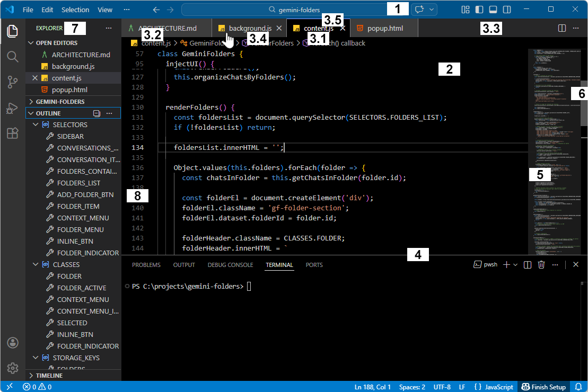
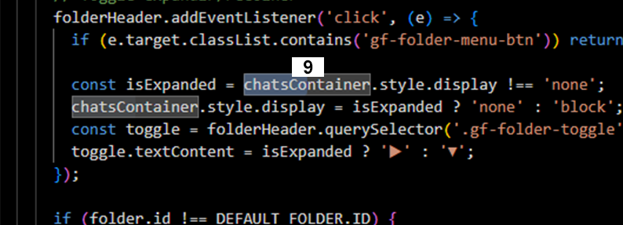

# README 

## Goal

The goal of this theme is to improve visual clarity and spatial awareness by reinforcing boundaries and contrast between key UI regions, making it easier to understand the layout at a glance.

## Motivation

The Visual Studio Dark theme is the theme I personally find most suitable and comfortable to use.

However, it presents a practical usability issue: difficulty in quickly identifying the boundaries between interface elements.

Elements such as the title bar, tab bar, editor area, minimap, and terminal visually blend into each other. This lack of clear separation increases cognitive load, causes small but constant distractions, and slows down navigation and orientation within the workspace.

I could not find a dark theme that addressed this usability issue while still remaining visually close to the Visual Studio Dark theme, so I created this theme.

## Scope
- No changes were made to syntax highlighting
- Changes are minimal and carefully selected
- Focus is exclusively on UI clarity and usability
- Small adjustments, but with a noticeable impact on daily use

## Improvements

**1.** Title bar: Increased contrast and more distinct coloring to clearly separate it from the rest of the interface\
**2.** Editor background: True black background for stronger contrast and better separation from surrounding elements\
**3.** Tabs and editor header with clearer contrast:\
&nbsp;&nbsp;&nbsp;&nbsp;**3.1.** active tab background color\
&nbsp;&nbsp;&nbsp;&nbsp;**3.2** inactive tabs background color\
&nbsp;&nbsp;&nbsp;&nbsp;**3.3** empty tab area background color\
&nbsp;&nbsp;&nbsp;&nbsp;**3.4** inactive tab hover gains emphasis on hover for better discoverability\
&nbsp;&nbsp;&nbsp;&nbsp;**3.5** active tab has the top border highlighted to reinforce focus\
**4.** Terminal: Visible border to clearly separate it from the editor area\
**5.** Minimap: Increased contrast to distinguish it from the editor content\
**6.** Scrollbar: More visible slider for easier interaction\
**7.** Side bar title: Slightly more prominent text for better readability and hierarchy\
**8.** Line numbers: Slightly dimmed to reduce noise while keeping readability\
**9.** Word highlight vs selection: Improved differentiation to avoid confusion between cursor-based highlights and actual text selection

## Result

The overall effect is a cleaner and more structured interface, where boundaries are easier to perceive and elements are quicker to identify, reducing visual friction during development.